# RNAival

RNAival is a python-based program for the identification of siRNAs candidates and the assessment of the processing of dsRNAs.

## Requirements
Linux, Mac or a WSL-capable Windows version

## Installation
```
bash install.sh
```
The installer will install miniforge into `~/RNAival_Dependencies` and install dependencies through conda.
The installer tries to create a desktop entry in usr/share/applications, which requires root-user priviliges, but is not critical for usage.
On Windows/WSL, prefix the commands with "wsl" or switch to a WSL terminal beforehand.

For more detailed installation instructions, see the manual.

## Run
```
bash run.sh
```

## Basic usage
- Create a new project
- Select sequencing libraries (fastq.gz)
- Select target sequences (embl,fasta,fna.gz)
- Select targets and evaluation types for libraries
- Run the pipeline


# GUI overview

The following excerpts from the GUI are based on data from Knoblich _et al._ 2023¹.
They investigated protecting plants against the cucumber mosaic virus (CMV) by using specially designed dsRNAs that interact with the plant's RNA interference pathway.

1. Knoblich, Marie, et al. "A new level of RNA-based plant protection: dsRNAs designed from functionally characterized siRNAs highly effective against Cucumber mosaic virus." 
Nucleic Acids Research 53.5 (2025): [gkaf136](https://doi.org/10.1093/nar/gkaf136). 

## Input files

1. Add the sequencing files and assign them appropriate names and comments
2. Add the mapping targets:
   1. Press "Add new target" and assign a proper name
   2. Add the main sequence
       - Fasta for AGO-IP / siRNA identification
       - embl (annotated dsRNA) for dsRNA processing analysis
   3. Optionally add further background sequences (fasta, fna.gz)
3. Select the created targets for the appropriate libraries
   - For each library with this target, select the target from the dropdown in the "Targets" column
4. Select the appropriate evaluation types for the libraries from the "Evaluation" column:
   - siRNA candidate identification (siI) for AGO-IP libraries
   - dsRNA processing evaluation (dsP) for Dicer/DCL-processed dsRNA libraries
5. If your data conforms to the recommended protocol, run the pipeline

The sequenceing libraries from both dsRNA constructs are mapped to the dsCMV6-21o sequence, since dsCMV6-21 is just a subsequence of that.
Mapping to the same sequence where possible allows for better comparisons and evaluation of the differences of the dsRNAs.

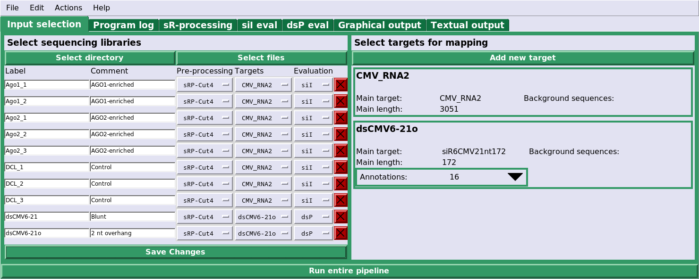

## Parameters for short-read processing (sRP)

If your data conforms to the recommended protocol, no further action is required here, otherwise:

1. Create a new parameterset and name it appropriately
2. Set parameters for:
   - Step 1: Adapter clipping
   - Step 2: Paired end merging

    Important here are the sequencing adapters used and possible other modifications.  
    The study from which this sample data is, had 4 extra nucleotides around RNA sequences, which need to be clipped after the adapters have been removed. 
    See the "Cut 5'/3' nucleotides after adapter clipping" parameter was set to "4" each.
    
    Step 3 and 4 generally do not need to be modified.
3. Select the newly created parameterset on the input page, column "Pre-processing", for all libraries that use it
4. Run the pipeline (Menubar -> Actions -> Run pipeline)

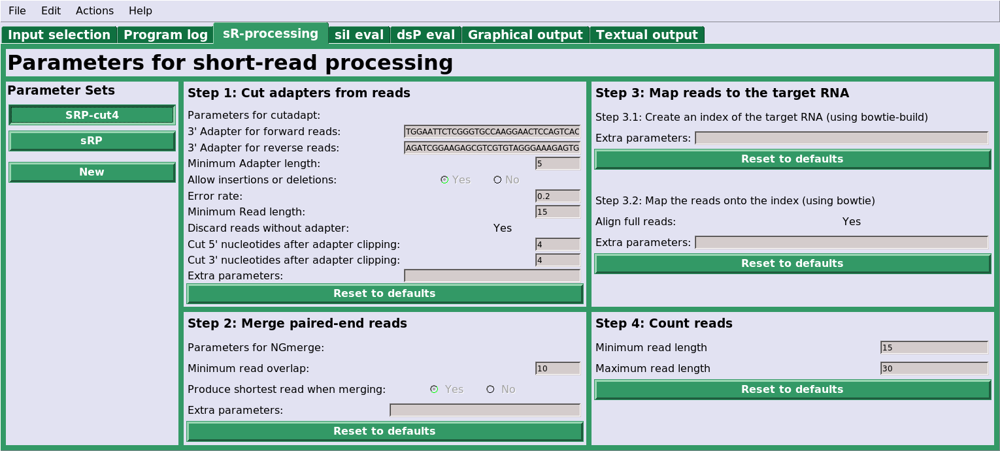

## Parameters for siRNA candidate identification (siI)

After the pipeline has finished processing the data, you have to tell the program which libraries are siRNA enriched and which are used as control, as well as to what AGO they belong:

1. Add a new enriched-control-pair by selecting the plus (+)
2. Give the new pair an appropriate label / name
3. Select the target + parameterset with which the libraries were processed
4. Select the enriched and control samples in the appropriate columns
4. Reload the graphics (Menubar -> Actions -> Reload graphics)

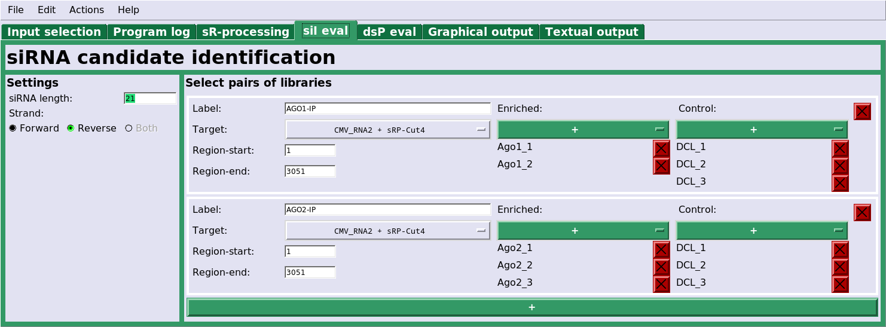

## Parameters for dsRNA processing evaluation (dsP)

Evaluation of dsRNA processing requires no user input, but the resulting graphs can be customised:

 - Use the checkbox to the right of each graph type to select whether to generate them or not
 - Select the range of lengths to display the length distribution over
 - Select which lengths to show on read distribution and coverage plots  
   Multiple length can be selected at the same time by using a comma-separated list, i.e. "21,22,23,24"
 - Select the lengths and their colour for the multicoverage-lineplot  
   The defalut colourscheme follows the okabe-ito palette
 - The Y-axes of all graphs of the same plot can be synchronised to have the same minimum and maximum values  
   This can highlight absolute differences between libraries, but make libraries with fewer reads less visible
 - The Y-axes for the length distribution graph can instead be scaled to percent of all reads, while the read distribution for a specific length as percentage of all reads of the selected length
 - Select colours used to show annotated siRNAs in the various graphs

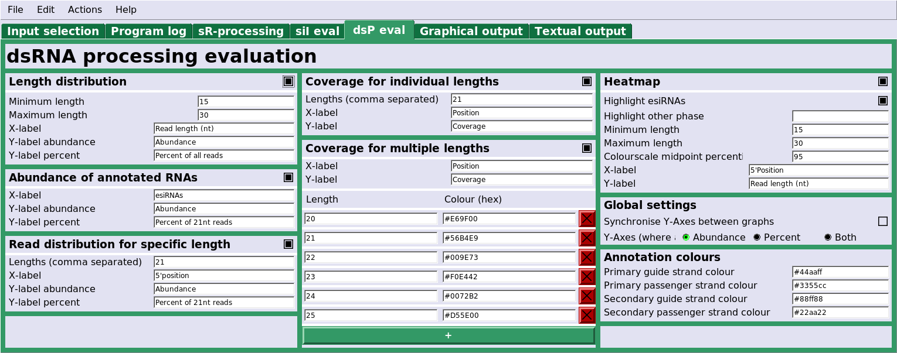

## Graphical output

After the pipeline has finished, or whenever you reload the graphics, RNAival will generate graphics for the evaluation of the data.

### siRNA identification

[Not yet implemented] RNAival will mark and write out the top 30 siRNA candidates.  
Alternatively, you can [clear the selection and] select them manually.  
Here is an example with the top candidates selected:

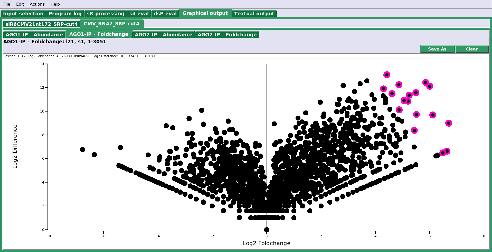

They will also be selected in the abundance distribution over the target RNA:

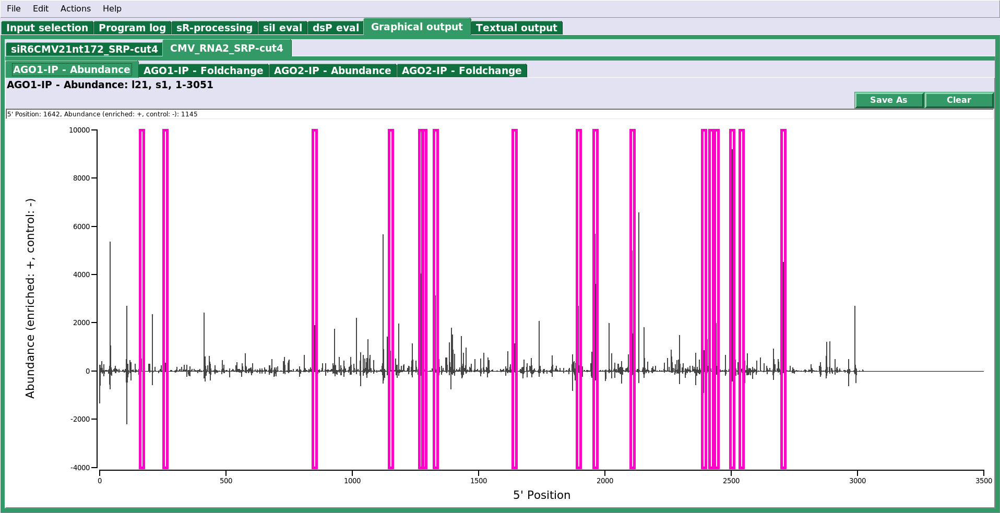

RNAival outputs information on the selected candidates into the text output tab:

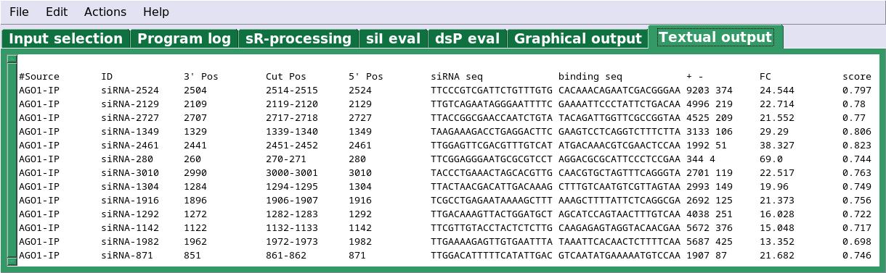

With the sequences of the candidates readily available, their cleavage efficiency can be tested and dsRNA can be constructed from them.

### dsRNA processing

RNAival generates various graphs to assess the processing of the input dsRNA.

#### Read length distribution

Distribution of read lengths observed in the samples. Negative values correspond to reads that map to the reverse strand of the dsRNA.

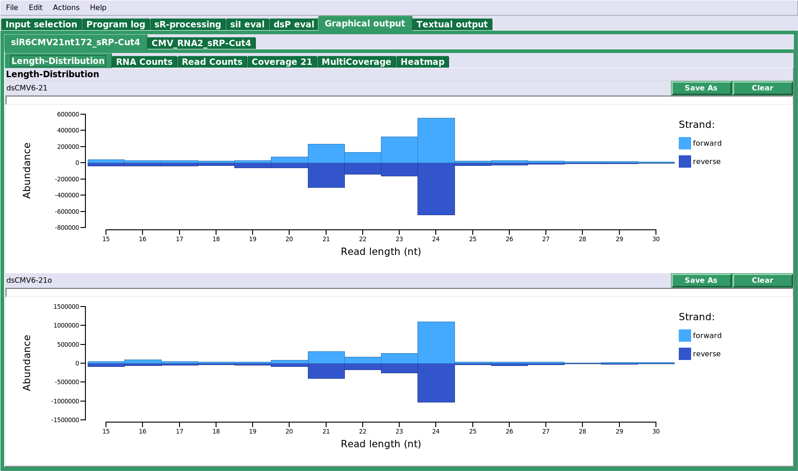

#### Annotation abundance

Abundance of only the annotated RNAs.

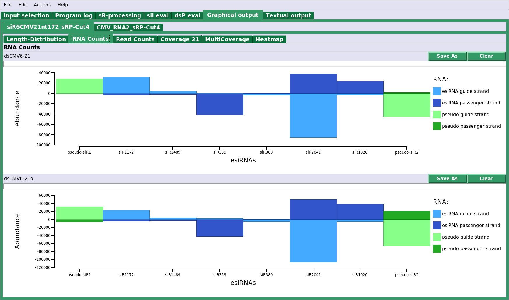

#### Abundance per read length

Abundance of each read of a specified length (21 nt in this case); The position corresponds to the 5' position of a read.
RNAival automatically highlights the the annotated siRNAs.

This shows that most 21 nt long reads correspond to the annotated siRNAs and implies that the dsRNA consruct was processed in a mostly regular pattern every 21 nucleotides. 
It also highlights the differences in abundance between different siRNAs. 

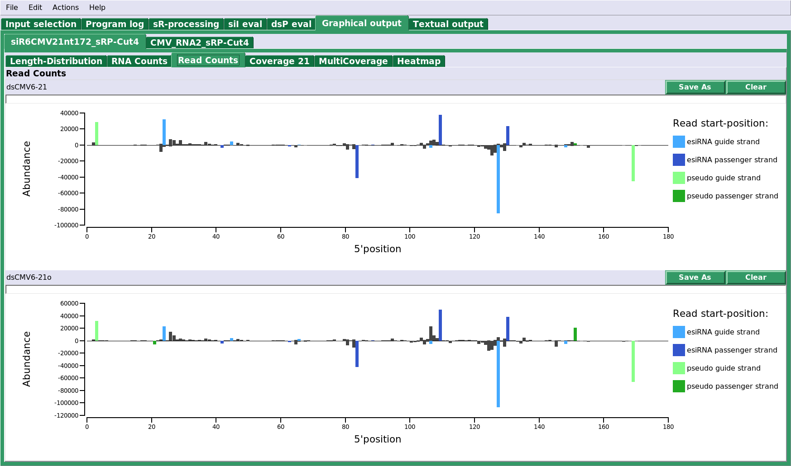

#### Read coverage per length

Coverage of all reads of length 21 over the dsRNA construct.
RNAival automatically highlights the coverage that comes from reads corresponding to the annotated siRNAs.
Same information content as the abundance graph, but better visualises the reads.

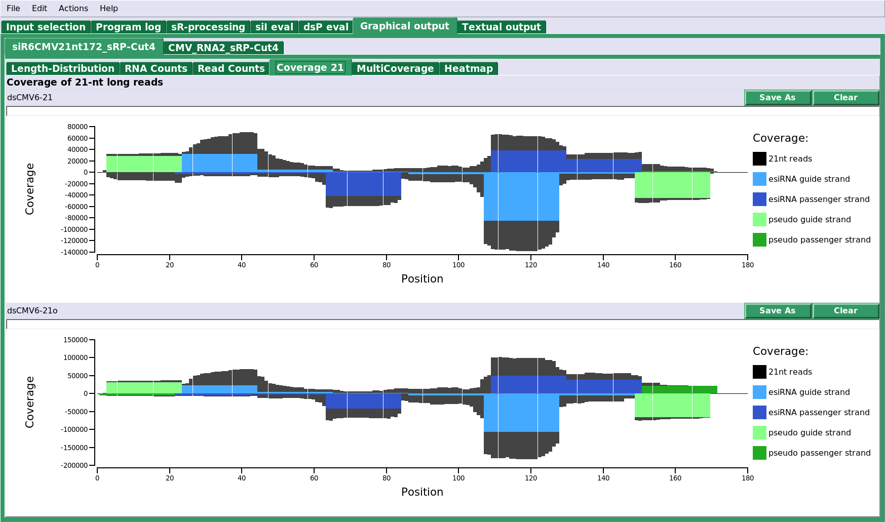

#### Coverage of mutliple lengths

The coverages of reads with different lengths all in the same graph.

Here we can see a higher abundance of 24 nt reads, compared to 21 nt reads.
This is in line with the higher activity of DCL3, which cuts 24 nt siRNA duplexes, compared to DCL4, which cuts 21 nt siRNA duplexes.

This graph also shows a strong difference between the blunt-end cosntruct (upper graph) and the 2nt overhang construct (lower graph):
DCL3&4 seem to cut more reliably in a regular interval if the dsRNA has 2nt overhangs. [compare to paper] ???

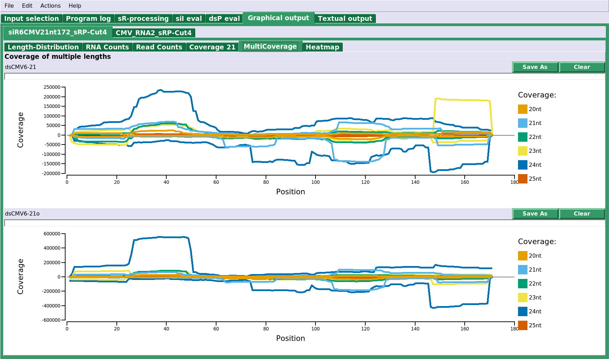

#### Heatmap of all reads

Heatmap over all read lengths and 5' positions on the dsRNA.

This graph clearly highlights the regular processing in 21 nt and 24 nt patterns.  
Of interest are these vertical and diagonal "lines" in the heatmap. These may indicate a 5' or 3' degradation of reads.

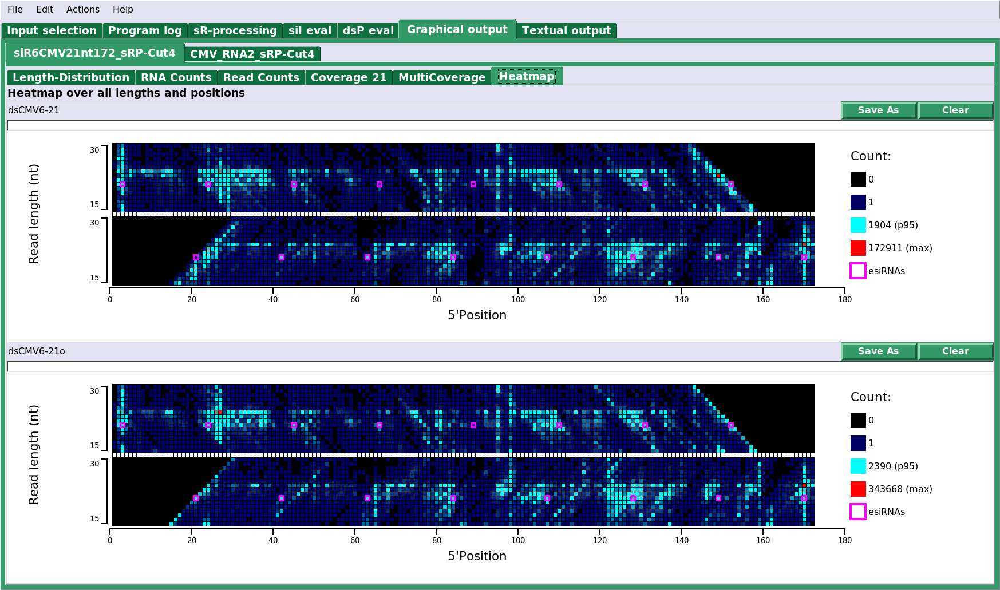
